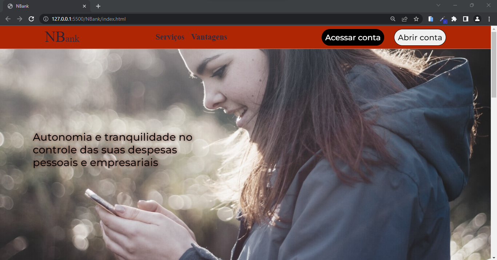
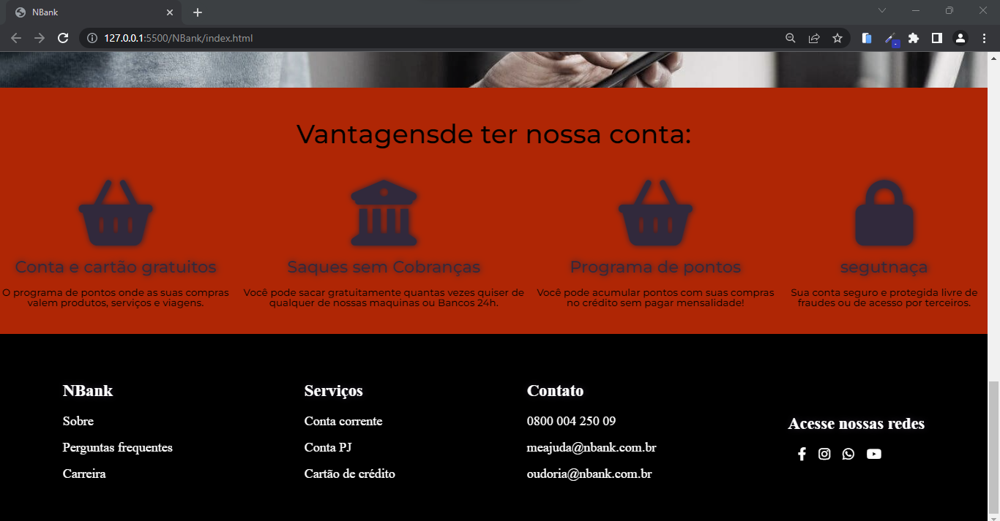

<h1 align="center"><a href="https://gustavo-freita.github.io/NBank/">Página do banco NBank</a></h1>

## Descrição do Projeto:

Esse projeto foi criado no intuito de testar meus conhecimentos com o Sass e o quanto eu consegui lembrar da utilização dele sem precisar pesquisar as funcionalidades para o uso da linguagem de folha de estilo.

<h2 align="center">

</h2>

<h3 align="center">
  
  
</h3>

### 🛠 Tecnologias

As seguintes ferramentas foram usadas na construção do projeto:

- [HTML](https://www.w3schools.com/html/)
- [CSS](https://www.w3schools.com/Css/)
- [Sass](https://sass-lang.com/)

### Autor
---
<a href="https://github.com/gustavo-freita">
 <b>Gustavo Freitas</b></a> <a href="https://github.com/gustavo-freita">🚀</a>

Feito com ❤️ por Gustavo Freitas 👋🏽 Entre em contato!

